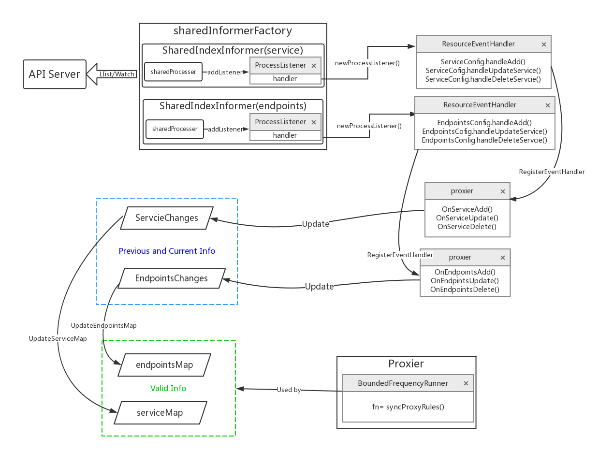

# 功能概述

kube-proxy是管理service的访问入口，包括集群内Pod到Service的访问和集群外访问service。当用户创建 service 的时候，endpointController 会根据service 的 selector 找到对应的 pod，然后生成 endpoints 对象保存到 etcd 中。运行在每个节点上的Kube-proxy会通过api-server 获得etcd 中 Service和Endpoints的变化信息，并调用 kube-proxy 配置的代理模式来更新主机上的iptables 转发规则,通过修改iptables规则改变报文的流向。

在v1.12版本中Kube-Proxy 已经实现了5种模式的的代理：userspace,ipatables,IPVS，kernelspace。winuserspace。
1. Userspace模式（k8s版本为1.2之前默认模式）：kube-rpxoy在用户空间监听一个端口，所有服务通过 iptables 转发到这个端口，然后在其内部负载均衡到实际的 Pod。该方式最主要的问题是效率低，有明显的性能瓶颈。
2. 使用Iptables模式（k8s版本为1.2之后默认模式)：iptables的方式则是利用了linux的iptables的nat转发进行实现，利用iptables的DNAT模块，实现了Service入到Pod实际地址的转换。 该方式最主要的问题是在服务多的时候产生太多的 iptables 规则，非增量式更新会引入一定的时延，大规模情况下有明显的性能问题
3. IPVS：v1.11 新增了 ipvs 模式（v1.8 开始支持测试版，并在 v1.11 GA）。
  IPVS是LVS的负载均衡模块，亦基于netfilter，但比iptables性能更高，具备更好的可扩展性，采用增量式更新，并可以保证 service 更新期间连接保持不断开
4. kernnelspace:
5. winuserspace：同 userspace，但工作在 windows 节点上

# 源码走读
本文以iptables 代理模式为例,对proxy 的功能实现进行分析。基于iptables的kube-proxy的主要职责包括两大块：一块是侦听service更新事件，并更新service相关的iptables规则，一块是侦听endpoint更新事件，更新endpoint相关的iptables规则。也就是说kube-proxy只是作为controller 负责更新更新规则，实现转发服务的是内核的netfilter，体现在用户态则是iptables。

## 重要结构体说明
### ProxyServer
ProxyServer 结构体中定义的属性代表了kube-proxy server 运行时需要的所有变量。kube-proxy server 调用的方法均来该结构体内变量拥有的方法。

kubernetes/cmd/proxy-server/app/server.go
```go
type ProxyServer struct {
	Client                 clientset.Interface
	EventClient            v1core.EventsGetter	
	IptInterface           utiliptables.Interface // 接口中定义了更新iptables 的方法集合，如DeleteChian,DeleteRule, EnsureChain,EnsureRule
	IpvsInterface          utilipvs.Interface // 定义操作ipvs 的方法集
	IpsetInterface         utilipset.Interface //定义了操作ipset 的方法集
	execer                 exec.Interface// 定义包装os/exec库中Command, Commandcontext, LookPath方法的接口
	Proxier                proxy.ProxyProvider //Proxier 有三种实现方式，分别对应Linux 环境中三种模式的代理模式
	Broadcaster            record.EventBroadcaster //接受Event，交于各个处理函数进行处理
	Recorder               record.EventRecorder // Event 记录者
	ConntrackConfiguration kubeproxyconfig.KubeProxyConntrackConfiguration
	Conntracker            Conntracker // if nil, ignored
	ProxyMode              string
	NodeRef                *v1.ObjectReference
	CleanupAndExit         bool
	CleanupIPVS            bool
	MetricsBindAddress     string  //127.0.0.1:10249  http prometheus metrics port;
	EnableProfiling        bool
	OOMScoreAdj            *int32 //通过一个数值用来表征进程当发生OOM时系统对该进程的行为
	ResourceContainer      string
	ConfigSyncPeriod       time.Duration //Default 15m0s
	ServiceEventHandler    config.ServiceHandler //
	EndpointsEventHandler  config.EndpointsHandler //
	HealthzServer          *healthcheck.HealthzServer // 0.0.0.0:10256  http healthz port;
}
```

### Proxier
在每一种代理模式下，都定义了自己的Proxier 结构体，该结构体及方法实现了该模式下的代理规则的更新方法。在Iptables 模式下，Proxier 结构体定义如下：

kubernetes/pkg/proxy/iptables/proxier.go

```go
type Proxier struct {
	//EndpointChangeTracker中items属性为一个两级map,用来保存所有namespace 下endpoints 的变化信息。
	//第一级map以namespece 为key，value 值为该namespace下所有endpoints 更新前（previous)、后(current)的信息。
	//前、后信息分别为一个map ,即第二级map: ServiceMap。
	//第二级map的key为ServicePortName 结构，标记endpoints 对应的service，value为endpoint信息。 
	// EndpointChangeTracker 中实现了更新endpoint 的方法
	endpointsChanges *proxy.EndpointChangeTracker
	
	// 同理，ServiceChangeTracker 中使用一个两级map保存所有namespace 下的service的变化信息，并定义了更新service的方法
	serviceChanges   *proxy.ServiceChangeTracker

	mu           sync.Mutex // protects the following fields
	
	serviceMap   proxy.ServiceMap // 同serviceChanges 的第二及map 结构，记录了所有namespace下需要更新iptables规则的service 
	endpointsMap proxy.EndpointsMap //同endpointsChanges 的第二及map 结构，记录了所有namespace 需要更新iptables规则的endpoints
	
	portsMap     map[utilproxy.LocalPort]utilproxy.Closeable

	endpointsSynced bool  // Proxier 初始化时为False 
	servicesSynced  bool // Proxier 初始化时为False
	initialized     int32
	
	syncRunner      *async.BoundedFrequencyRunner //async.BoundedFrequencyRunner 具有QPS功能，控制被托管方法的发生速率

	// These are effectively const and do not need the mutex to be held.
	iptables       utiliptables.Interface //iptables的执行器，定义了Iptables 的操作方法
	masqueradeAll  bool 
	masqueradeMark string
	exec           utilexec.Interface // 抽象了 os/exec 中的方法
	clusterCIDR    string
	hostname       string
	nodeIP         net.IP
	portMapper     utilproxy.PortOpener //以打开的UDP或TCP端口
	recorder       record.EventRecorder
	healthChecker  healthcheck.Server
	healthzServer  healthcheck.HealthzUpdater
	
	precomputedProbabilities []string

	iptablesData             *bytes.Buffer
	existingFilterChainsData *bytes.Buffer
	filterChains             *bytes.Buffer
	filterRules              *bytes.Buffer
	natChains                *bytes.Buffer
	natRules                 *bytes.Buffer

	endpointChainsNumber int

	// Values are as a parameter to select the interfaces where nodeport works.
	nodePortAddresses []string
	// networkInterfacer defines an interface for several net library functions.
	// Inject for test purpose.
	networkInterfacer utilproxy.NetworkInterfacer
}
```
### Proxier 自定义的链
在iptables 原有的5个链上，k8s 又增加了以下自定义链，在自定义链上添加规则，以控制iptables 对k8s 数据包的转发。

```go
const (
	iptablesMinVersion = utiliptables.MinCheckVersion // 支持-C/--flag 参数的iptable 最低版本
	//对于Service type=ClusterIP的每个端口都会在KUBE-SERVICES中有一条对应的规则
	kubeServicesChain utiliptables.Chain = "KUBE-SERVICES" 
	
	//
	kubeExternalServicesChain utiliptables.Chain="KUBE-EXTERNAL-SERVICES"
	
	//对于Service type=NodePort的每个端口都会在KUBE-NODEPORTS中有一条对应的规则
	kubeNodePortsChain utiliptables.Chain = "KUBE-NODEPORTS"
	
	//在KUBE-POSTROUTING链上，对(0x400)包做SNAT
	kubePostroutingChain utiliptables.Chain = "KUBE-POSTROUTING"
	
	//打标签链，对于进入此链的报文打标签(0x400)，预示被标签包要做NAT
	KubeMarkMasqChain utiliptables.Chain = "KUBE-MARK-MASQ" 
	
	//打标签链，对于进入此链的报文打标签(0x800)，预示此包将要被放弃
	KubeMarkDropChain utiliptables.Chain = "KUBE-MARK-DROP" 
	
	//跳转
	kubeForwardChain utiliptables.Chain = "KUBE-FORWARD"
)
```

## Proxy Server 启动
穿过cobra.Command 包装的一个启动命令，走到跟kube-proxy 服务相关的一个代码入口 Run()。在Run()中，主要就是两件事：
1. 生成一个ProxyServer 实例；

2. 运行ProxyServer 实例的Run 方法，运行服务。

kubernetes/cmd/kube-proxy/app/server.go

```go
func (o *Options) Run() error {
	if len(o.WriteConfigTo) > 0 {
		return o.writeConfigFile()
	}

	proxyServer, err := NewProxyServer(o)  //初始化结构体ProxyServer
	if err != nil {
		return err
	}

	return proxyServer.Run() // 运行ProxyServer
}
```
## ProxyServer 初始化

进入NewProxyServer(o) 方法，开始ProxyServer 的初始化过程初始化过程中，重要的一个环节就是根据不同的代理模式生成不通的Proxier。初始化过程中，主要变量的初始化及作用已在代码中说明。

kubernetes/cmd/proxy-server/app/server_others.go

```go
func newProxyServer(
	config *proxyconfigapi.KubeProxyConfiguration,
	cleanupAndExit bool,
	cleanupIPVS bool,
	scheme *runtime.Scheme,
	master string) (*ProxyServer, error) {
    ...
	protocol := utiliptables.ProtocolIpv4 // 获取机器使用的IP协议版本，默认使用IPV4
    ...
	// Create a iptables utils.
	execer := exec.New()  // 包装了os/exec中的command,LookPath,CommandContext 方法，组装一个系统调用的命令和参数
	dbus = utildbus.New()
	//iptInterface 赋值为runner结构体，该结构体实现了接口utiliptables.Interface中定义的方法，
	//各方法中通过runContext()方法调用execer的命令包装方法返回一个被包装的iptables 命令
	iptInterface = utiliptables.New(execer, dbus, protocol)
    ...
    //EventBroadcaster会将收到的Event交于各个处理函数进行处理。接收Event的缓冲队列长为1000，不停地取走Event并广播给各个watcher;
    //watcher通过recordEvent()方法将Event写入对应的EventSink里，最大重试次数为12次，重试间隔随机生成(见staging/src/k8s.io/client-go/tools/record/event.go);
    // EnventSink  将在ProxyServer.Run() 中调用s.Broadcaster.StartRecordingToSink（） 传进来;
    // NewBroadcaster() 最后会启动一个goroutine 运行Loop 方法（staging/src/k8s.io/apimachinery/pkg/watch/mux.go),
	eventBroadcaster := record.NewBroadcaster()
	
	//EventRecorder通过generateEvent()实际生成各种Event，并将其添加到监视队列。
	recorder := eventBroadcaster.NewRecorder(scheme, v1.EventSource{Component: "kube-proxy", Host: hostname})
    ...
	if len(config.HealthzBindAddress) > 0 {//服务健康检查的 IP 地址和端口（IPv4默认为0.0.0.0:10256，对于所有 IPv6 接口设置为 ::）
		healthzServer = healthcheck.NewDefaultHealthzServer(config.HealthzBindAddress, 2*config.IPTables.SyncPeriod.Duration, recorder, nodeRef)
		healthzUpdater = healthzServer
	}
    ...
	proxyMode := getProxyMode(string(config.Mode), iptInterface, kernelHandler, ipsetInterface, iptables.LinuxKernelCompatTester{})
    ...
	if proxyMode == proxyModeIPTables { 
		klog.V(0).Info("Using iptables Proxier.")
		if config.IPTables.MasqueradeBit == nil {
			// MasqueradeBit must be specified or defaulted.
			return nil, fmt.Errorf("unable to read IPTables MasqueradeBit from config")
		}

		// 返回一个Proxier 结构体实例 
		proxierIPTables, err := iptables.NewProxier(...) //参数略
		if err != nil {
			return nil, fmt.Errorf("unable to create proxier: %v", err)
		}
		metrics.RegisterMetrics()
		proxier = proxierIPTables
		// Iptables Proxier 实现了 ServiceHandler 和 EndpointsHandler 的接口。
		serviceEventHandler = proxierIPTables  
		endpointsEventHandler = proxierIPTables
	
		userspace.CleanupLeftovers(iptInterface)// 无条件强制清除之前userspace 模式的规则
        
        // 因为无法区分iptables 规则是否由IPVS 代理生成，因此由用户根据实际情况决定是否调用ipvs.CleanupLeftovers()
		if canUseIPVS {
			ipvs.CleanupLeftovers(ipvsInterface, iptInterface, ipsetInterface, cleanupIPVS)
		}
	} else if proxyMode == proxyModeIPVS {// 初始化IPVS Proxier
		
	} else { // 初始化 userspace Proxier

	}

	iptInterface.AddReloadFunc(proxier.Sync)

	return &ProxyServer{ // 赋值过程略
	...
	}, nil
}
```

## Proxier 初始化

kubernetes/pkg/proxy/iptables/proxier.go

```go
func NewProxier(...) (*Proxier, error) { //参数略
	...
    //kube-proxy要求NODE节点操作系统中有/sys/module/br_netfilter模块，还要设置bridge-nf-call-iptables=1；
    //如果不满足要求，kube-proxy在运行过程中设置的某些iptables规则就不会工作。 
	if val, err := sysctl.GetSysctl(sysctlBridgeCallIPTables); err == nil && val != 1 {
		klog.Warning("missing br-netfilter module or unset sysctl br-nf-call-iptables; proxy may not work as intended")
	}

	// Generate the masquerade mark to use for SNAT rules.
    masqueradeValue := 1 << uint(masqueradeBit) //masqueradeBit: Default 14
    // 输出一个8位16进制数值 ，默认即0x00004000/0x00004000,用来标记k8s管理的报文。
    //标记 0x4000的报文（即POD发出的报文)，在离开Node（物理机）的时候需要进行SNAT转换。
	masqueradeMark := fmt.Sprintf("%#08x/%#08x", masqueradeValue, masqueradeValue) 

	healthChecker := healthcheck.NewServer(hostname, recorder, nil, nil) // use default implementations of deps

	isIPv6 := ipt.IsIpv6()
	proxier := &Proxier{
		portsMap:                 make(map[utilproxy.LocalPort]utilproxy.Closeable),
		serviceMap:               make(proxy.ServiceMap),
		serviceChanges:           proxy.NewServiceChangeTracker(newServiceInfo, &isIPv6, recorder),
		endpointsMap:             make(proxy.EndpointsMap),
		endpointsChanges:         proxy.NewEndpointChangeTracker(hostname, newEndpointInfo, &isIPv6, recorder),
		iptables:                 ipt,
		masqueradeAll:            masqueradeAll,// 如果使用纯 iptables 代理，SNAT 所有通过服务 IP 发送的流量，默认False
		masqueradeMark:           masqueradeMark,
		exec:                     exec,
		clusterCIDR:              clusterCIDR,
		hostname:                 hostname,
		nodeIP:                   nodeIP,
		portMapper:               &listenPortOpener{},
		recorder:                 recorder,
		healthChecker:            healthChecker,
		healthzServer:            healthzServer,
		precomputedProbabilities: make([]string, 0, 1001),
		iptablesData:             bytes.NewBuffer(nil),
		existingFilterChainsData: bytes.NewBuffer(nil),
		filterChains:             bytes.NewBuffer(nil),
		filterRules:              bytes.NewBuffer(nil),
		natChains:                bytes.NewBuffer(nil),
		natRules:                 bytes.NewBuffer(nil),
		nodePortAddresses:        nodePortAddresses,
		networkInterfacer:        utilproxy.RealNetwork{},
	}
	burstSyncs := 2
    ...
    //Default: syncPeriod=30s (--iptables-sync-period duration)，将proxier.syncProxyRules 托管至BoundedFrequencyRunner 结构体，
    //BoundedFrequencyRunner 中含有一个Limiter ，该Limiter 采用"桶令牌" 限流算法控制proxier.syncProxyRules 方法运行的频率。
    //minSyncPeriod=0 时，无速率限制。限流时，桶类初始令牌数量为burstSyncs。
	proxier.syncRunner = async.NewBoundedFrequencyRunner("sync-runner", proxier.syncProxyRules, minSyncPeriod, syncPeriod, burstSyncs)
	return proxier, nil
}
```

## 注册ResourceHandler

ProxyServer 及Proxier 这两个重要的结构体初始化完成以后，就进入了proxyServer.Run() 方法。在Run() 方法中，大致做了如下工作：

1. 准备工作，如设置OOMScoreAdj,  注册service 和endpoints 的处理方法

2. 使用list-watch 机制对service，endpoints资源监听。

3. 最后进入一个无限循环，对service与endpoints的变化进行iptables规则的同步。

在Run方法中，主要关注一下对service 和endpoints资源变化的处理方法的注册过程。

kubernetes/cmd/proxy-server/app/server.go
```go
func (s *ProxyServer) Run() error {
    ...

	//在用户空间通过写oomScoreAdj参数到/proc/self/oom_score_adj文件来改变进程的 oom_adj 内核参数；
	//oom_adj的值的大小决定了进程被 OOM killer，取值范围[-1000,1000] 选中杀掉的概率,值越低越不容易被杀死.此处默认值是-999。
	if s.OOMScoreAdj != nil { 
		oomAdjuster = oom.NewOOMAdjuster() 
		if err := oomAdjuster.ApplyOOMScoreAdj(0, int(*s.OOMScoreAdj)); err != nil {
			klog.V(2).Info(err)
		}
	}

	if len(s.ResourceContainer) != 0 {
	    ...
	    //
		resourcecontainer.RunInResourceContainer(s.ResourceContainer); 
		...
	}

	if s.Broadcaster != nil && s.EventClient != nil {
	    // EventSinkImpl 包装了处理event 的方法create ,update, patchs
	    //s.Broadcaster 已经在ProxyServer 初始化中作为一个goroutine 在运行。
		s.Broadcaster.StartRecordingToSink(&v1core.EventSinkImpl{Interface: s.EventClient.Events("")})
	}

	// Start up a healthz server if requested
	if s.HealthzServer != nil {
		s.HealthzServer.Run()
	}

	// Start up a metrics server if requested
	if len(s.MetricsBindAddress) > 0 {
	...
	}

	// Tune conntrack, if requested
	// Conntracker is always nil for windows
	if s.Conntracker != nil {
		max, err := getConntrackMax(s.ConntrackConfiguration)
		...
	}
    // Default: s.ConfigSyncPeriod =15m (--config-sync-period)
    //返回一个sharedInformerFactory结构体实例(staing/src/k8s.io/client-go/informers/factory.go)
	informerFactory := informers.NewSharedInformerFactory(s.Client, s.ConfigSyncPeriod)


	//ServiceConfig结构体跟踪记录Service配置信息的变化
	//informerFactory.Core().V1().Services() 返回一个 serviceInformer 结构体引用(staing/src/k8s.io/client-go/informers/core/v1/service.go
	serviceConfig := config.NewServiceConfig(informerFactory.Core().V1().Services(), s.ConfigSyncPeriod)
	
	//RegisterEventHandler 是将Service的处理方法追加到serviceConfig的eventHandlers 中，eventHandlers为一个列表，元素类型ServiceHandler接口
	// ServiceHandler接口定义了每个hanlder 处理service的api方法:OnServiceAdd,OnServiceUpdate,OnServiceDelete,OnServiceSynced
	// 此处s.ServiceEventHandler 为proxier，proxier实现了ServiceHandler接口定义的方法
	//serviceConfig 中的handleAddService,handleUpdateService,handleDeleteService 将会调用每个eventHandler的OnServiceAdd等方法
	serviceConfig.RegisterEventHandler(s.ServiceEventHandler)
	go serviceConfig.Run(wait.NeverStop)  //初始化同步service,调用了一次proxier.syncProxyRules()

	endpointsConfig := config.NewEndpointsConfig(informerFactory.Core().V1().Endpoints(), s.ConfigSyncPeriod)
	endpointsConfig.RegisterEventHandler(s.EndpointsEventHandler)
	go endpointsConfig.Run(wait.NeverStop)

	// This has to start after the calls to NewServiceConfig and NewEndpointsConfig because those
	// functions must configure their shared informer event handlers first.
	go informerFactory.Start(wait.NeverStop)

	// Birth Cry after the birth is successful
	s.birthCry()

	// Just loop forever for now...
	s.Proxier.SyncLoop()
	return nil
}
```
上面以注释的方式描述了proxier中service处理方法的被调用流程：通过serviceConfig.RegisterEventHandler()方法实现了在serviceConfig中的handleAddService()等方法中调用proxier中的OnServiceAdd()等对应的方法。那么serviceConfig.handleAddService()等方法是在哪里以及何时被调用的呢？再次回看serviceConfig的实例化方法 NewServiceConfig() 挖掘handleAddService()的被调用处。

kubernetes/pkg/proxy/config/config.go

```go
func NewServiceConfig(serviceInformer coreinformers.ServiceInformer, resyncPeriod time.Duration) *ServiceConfig {
	result := &ServiceConfig{
		lister:       serviceInformer.Lister(),
		listerSynced: serviceInformer.Informer().HasSynced,
	}
    //结构体cache.ResourceEventHandlerFuncs 是一个ResourceEventHandler接口类型(staing/src/k8s.io/client-go/tools/cache/controller.go)
    //将ServicConfig 结构体的handleAddService 等方法赋予了cache.ResourceEventHandlerFuncs,实现一个ResourceEventHandler实例
    //serviceInformer.Informer() 返回一个sharedIndexInformer 实例(staing/src/k8s.io/client-go/tools/cache/shared_informer.go)
    //通过AddEventHandlerWithResyncPeriod() 方法，将ResourceEventHandler实例赋值给processorListener结构体的handler属性
	serviceInformer.Informer().AddEventHandlerWithResyncPeriod(
		cache.ResourceEventHandlerFuncs{
			AddFunc:    result.handleAddService,
			UpdateFunc: result.handleUpdateService,
			DeleteFunc: result.handleDeleteService,
		},
		resyncPeriod,
	)
	return result
}
```
看完上面的注释，大概就明白了proxier 中的OnServiceAdd() 等法法的调用流程
在上边代码serviceInformer.Informer()返回之前，还将调用InformerFor()方法给informerFactory的informers属性赋值```f.informers[informerType] = informer```, 此行代码的意义可理解为：从api server 监听到 informerType类型资源变化的处理者记录(映射)为informer。此处的资源类型即为service, informer 便为sharedIndexInformer。

具体的调用时机和最上层方法入口还要从informerFactory这个东西说起，这又是k8s 中另一个比较系统的公共组件的实现原理了，即client-go的SharedInformer。

## 记录资源变化

上面介绍了ResourceHandler 的注册及被调用过程。 Proxier 实现了 services 和 endpoints 事件各种最终的观察者，最终的事件触发都会在 proxier 中进行处理。对于通过监听 API Server 变化的信息，通过调用ResourceHandler将变化的信息保存到 endpointsChanges 和 serviceChanges。那么一个ResourceHandler是如何实现的呢？service 和endpoints 的变化如何记录为servriceChanges 和endpointsChanges？回看上边源码中被注册的对象s.ServiceEventHandler，s.EndpointsEventHandler的具体实现便可明白。

service 和endpoints 的处理原则相似，以对servcie 的处理为例，看一下对service 的处理方法。

pkg/proxy/iptables/proxier.go

```go
func (proxier *Proxier) OnServiceAdd(service *v1.Service) { 
	proxier.OnServiceUpdate(nil, service)
}

func (proxier *Proxier) OnServiceUpdate(oldService, service *v1.Service) {
	if proxier.serviceChanges.Update(oldService, service) && proxier.isInitialized() {
		proxier.syncRunner.Run() // 通过channel 发送一个信号，调用tryRun()
	}
}

func (proxier *Proxier) OnServiceDelete(service *v1.Service) { 
	proxier.OnServiceUpdate(service, nil)
```

从上边代码中，可以看到，对service的处理方法大致分为三种：

1. 增加一个service
2. 删除一个service
3. 处理一个已存在的service的变化。

其中，增加、删除service 都是给OnServiceUpdate() 传入参数后，由OnServiceUpdate() 方法处理。因此，重点看一下OnServiceUpdate()调用的update() 方法的实现。

pkg/proxy/service.go

```go
func (sct *ServiceChangeTracker) Update(previous, current *v1.Service) bool {
	svc := current
	if svc == nil {
		svc = previous
	}
	// previous == nil && current == nil is unexpected, we should return false directly.
	if svc == nil {
		return false
	}
	namespacedName := types.NamespacedName{Namespace: svc.Namespace, Name: svc.Name}

	sct.lock.Lock()
	defer sct.lock.Unlock()

	change, exists := sct.items[namespacedName] 
	if !exists { // 在serviceChanges 中不存在一个以namespacedName 为key 的资源 
		change = &serviceChange{}  // 初始化一个serviceChange
		change.previous = sct.serviceToServiceMap(previous)
		sct.items[namespacedName] = change
	}
	change.current = sct.serviceToServiceMap(current)
	// if change.previous equal to change.current, it means no change
	if reflect.DeepEqual(change.previous, change.current) { // 从update传递进来的资源没有变化，则从serviceChanges中删除。
		delete(sct.items, namespacedName) 
	}
	return len(sct.items) > 0
}
```

update 方法就是根据previous ,current  参数新生成一个change 或者修改一个存在的change。并且把无变化的资源从serviceChanges 中删除。serviceChanges.items 会在将变化信息更新到proxier.serviceMap 后清空。


## 限流同步机制

在对proxy server 关心的资源变化进行了监听记录之后，最后从s.Proxier.SyncLoop()进入proxier.syncRunner.Loop()方法，由proxier.syncRunner 对托管syncProxyRules() ，syncProxyRules() 实现了修改iptables规则的具体流程。此处值得留意的是proxier.syncRunner采用“令牌桶”算法实现了限流的同步控制。

pkg/utils/async/bounded_frequency_runner.go

```go
func (bfr *BoundedFrequencyRunner) Loop(stop <-chan struct{}) {
	klog.V(3).Infof("%s Loop running", bfr.name)
	bfr.timer.Reset(bfr.maxInterval)
	for {
		select {
		case <-stop:
			bfr.stop()
			klog.V(3).Infof("%s Loop stopping", bfr.name)
			return
	    //先确认是否到了运行时机，如果可以运行，就调用syncProxyRules()，之后重新计时。
		//具体参考Timer 的实现机制
		case <-bfr.timer.C():
			bfr.tryRun()  
		case <-bfr.run: //收到一个channel信号
			bfr.tryRun()
		}
	}
}
```

## 修改 Iptables 规则

介绍了资源监听、记录和同步机制，再来看一下kube-proxy是如何将资源的变化反馈到iptables规则中的。在iptables的代理模式中，syncProxyRule()方法实现了修改iptables规则的细节流程。走读分析该方法，能将明白在node节点观察到的新链及规则产生的方式及目的。

syncProxyRules()这一单个方法的代码较长（约700+ 行），具体的细节功能也多，本节将对syncProxyRules()里的代码执行流程分开介绍。

1. 更新proxier.endpointsMap，proxier.servieMap。

   proxier.serviceMap：把sercvieChanges.current 写入proxier.serviceMap，再把存在于sercvieChanges.previous 但不存在于sercvieChanges.current 的service 从 proxier.serviceMap中删除，并且删除的时候，把使用UDP协议的cluster_ip 记录于UDPStaleClusterIP 。

   proxier.endpointsMap：把endpointsChanges.previous 从proxier.endpointsMap 删除，再把endpointsChanges.current 加入proxier.endpointsMap。把存在于endpointsChanges.previous 但不存在于endpointsChanges.current 的endpoint 组装为ServiceEndpoint 结构，把该结构记录于staleEndpoints。

​       具体相关代码流程如下：

```go
//kubernetes/pkg/proxy/iptables/proxier.go
func (proxier *Proxier) syncProxyRules() {
    ...
	serviceUpdateResult := proxy.UpdateServiceMap(proxier.serviceMap, proxier.serviceChanges)
	endpointUpdateResult := proxy.UpdateEndpointsMap(proxier.endpointsMap, proxier.endpointsChanges)
	
	staleServices := serviceUpdateResult.UDPStaleClusterIP
	
	// 利用endpointUpdateResult.StaleServiceNames，再次更新 staleServices
	for _, svcPortName := range endpointUpdateResult.StaleServiceNames {
		if svcInfo, ok := proxier.serviceMap[svcPortName]; ok && svcInfo != nil && svcInfo.GetProtocol() == v1.ProtocolUDP {
			klog.V(2).Infof("Stale udp service %v -> %s", svcPortName, svcInfo.ClusterIPString())
			staleServices.Insert(svcInfo.ClusterIPString())
		}
	}
    ...
}   

//kubernetes/pkg/proxy/servcie.go
func UpdateServiceMap(serviceMap ServiceMap, changes *ServiceChangeTracker) (result UpdateServiceMapResult) {
	result.UDPStaleClusterIP = sets.NewString()
	// apply 方法中，继续调用了merge，filter, umerge
	// merge:将change.current的servicemap 信息合入proxier.servicemap中。
	// filter:将change.previous和change.current共同存在的servicemap从将change.previous删除
	// unmerge: 将change.previous 中使用UDP 的servicemap 从 proxier.serviceMap 中删除，并记录删除的服务IP 到UDPStaleClusterIP
	//apply中最后重置了proxy.serviceChanges.items
	serviceMap.apply(changes, result.UDPStaleClusterIP)

	//HCServiceNodePorts 保存proxier.serviceMap 中所有服务的健康检查端口
	result.HCServiceNodePorts = make(map[types.NamespacedName]uint16)
	for svcPortName, info := range serviceMap {
		if info.GetHealthCheckNodePort() != 0 {
			result.HCServiceNodePorts[svcPortName.NamespacedName] = uint16(info.GetHealthCheckNodePort())
		}
	}
	return result
}

//kubernetes/pkg/proxy/endpoints.go
func UpdateEndpointsMap(endpointsMap EndpointsMap, changes *EndpointChangeTracker) (result UpdateEndpointMapResult) {
	result.StaleEndpoints = make([]ServiceEndpoint, 0)
	result.StaleServiceNames = make([]ServicePortName, 0)

    //从proixer.endpointsMap 中删除和change.previous 相同的elelment.
    // 将change.current 添加至proixer.endpointsMap
    // StaleEndpoints 保存了存在于previous 但不存在current的endpoints
    // StaleServicenames保存了一种ServicePortName,这样的ServicePortName在change.previous不存在对应的endpoints，在change.current存在endpoints。
    // 最后重置了了proxy.endpointsChanges.items
	endpointsMap.apply(changes, &result.StaleEndpoints, &result.StaleServiceNames)

	// computing this incrementally similarly to endpointsMap.
	result.HCEndpointsLocalIPSize = make(map[types.NamespacedName]int)
	localIPs := GetLocalEndpointIPs(endpointsMap)
	for nsn, ips := range localIPs {
		result.HCEndpointsLocalIPSize[nsn] = len(ips)
	}
	return result
}
```


2. 在准好了更新iptables需要的资源变量后，接下来就是调用iptables 命令建立了自定义链，并在对应的内核链上引用这些自定义链。这些自定义链在k8s 服务中是必须的，不会跟随资源变化而变化，所以在更新规则之前，提前无条件生成这些链，做好准备工作，随后会在这些自定义链上创建相应的规则。

   需要注意的是，在内核固定链引用K8S 的链时，这些新链都是作为内核固定链在nat表或filter表中的第一条规则。这样，所有进入固定链的流包在nat或filter 时，都会导入自定义链中。特别地，PREROUTING 和OUTPUT 的首条NAT规则都先将所有流量导入KUBE-SERVICE 链中，这样就截获了所有的入流量和出流量，进而可以对k8s 相关流量进行重定向处理。

   相关代码如下：

```go
	for _, chain := range iptablesJumpChains {
		if _, err := proxier.iptables.EnsureChain(chain.table, chain.chain); err != nil { //创建链
			klog.Errorf("Failed to ensure that %s chain %s exists: %v", chain.table, kubeServicesChain, err)
			return
		}
		args := append(chain.extraArgs,
			"-m", "comment", "--comment", chain.comment,
			"-j", string(chain.chain),
		)
		if _, err := proxier.iptables.EnsureRule(utiliptables.Prepend,  chain.table, chain.sourceChain, args...); err != nil { // 引用链
			klog.Errorf("Failed to ensure that %s chain %s jumps to %s: %v", chain.table, chain.sourceChain, chain.chain, err)
			return
		}
	}  
```
上边代码完成的iptables命令如下：

```go
iptables -w -N KUBE-EXTERNAL-SERVICES  -t filter
iptables -w -I  INPUT -t filter -m conntrack --ctstate NEW  -m  comment --comment -j KUBE-EXTERNAL-SERVICES  kubernetes externally-visible service portals

iptables -w -N KUBE-SERVICES  -t filter  
iptables -w -I OUTPUT -t filter  -m conntrack --ctstate NEW  -m  comment --comment -j  KUBE-SERVICES  kubernetes service portals

iptables -w -N KUBE-SERVICES  -t nat
iptables -w -I OUTPUT -t nat  -m conntrack --ctstate NEW  -m  comment --comment -j  KUBE-SERVICES  kubernetes service portals

iptables -w -N KUBE-SERVICES  -t nat
iptables -w -I PREROUTING -t nat  -m conntrack --ctstate NEW  -m  comment --comment -j  KUBE-SERVICES  kubernetes service portals

iptables -w -N KUBE-POSTROUTING  -t nat
iptables -w -I POSTROUTING -t nat  -m conntrack --ctstate NEW  -m  comment --comment -j  KUBE-POSTROUTING  kubernetes postrouting rules

iptables -w -N KUBE-FORWARD  -t filter
iptables -w -I FORWARD -t filter  -m conntrack --ctstate NEW  -m  comment --comment -j KUBE-FORWARD  kubernetes forwarding rules
```


3. 将当前内核中filter表和nat 表中的全部规则临时导出到数个buffer，具体的：
   - 使用 proxier.existingFilterChainsData 保存filter表的信息

   - 使用 existingFilterChains保存 proxier.existingFilterChainsData  的chain 信息

   - 使用 proxier.iptablesData 保存nat 表的信息

   - 使用 existingNATChains 保存 proxier.iptablesData  的chain 信息

   - 重置 proxier.filterChains，proxier.filterRules，proxier.natChains，proxier.natRules 四个buffer , 这四个buffer 用来缓存最新的关于k8s 服务于endpoints 的 iptables 信息。

----------------------------------------------------------------------------------------------------------------------------------------
在上面准备工作做好之后，开始向上述四个buffer中根据条件不断追加内容，缓存内容在同步规则的最后环节刷入内核。

4. 首先保证

   - 将KUBE-SERVICES，KUBE-EXTERNAL-SERVICES、KUBE-FORWARD 链写入proxier.filterChains ，链的来源为 existingFilterChains中已存在的或新创建的。
   - 将KUBE-SERVICES，KUBE-NODEPORTS，KUBE-POSTROUTING、KUBE-MARK-MASQ 链写入proxier.natChains中，链的来源为 existingNATChains 中已存在的或新创建的。

   相关代码流程如下

```go
for _, chainName := range []utiliptables.Chain{kubeServicesChain, kubeExternalServicesChain, kubeForwardChain} {
		if chain, ok := existingFilterChains[chainName]; ok {
			writeBytesLine(proxier.filterChains, chain)
		} else {
			writeLine(proxier.filterChains, utiliptables.MakeChainLine(chainName))
		}
	}
for _, chainName := range []utiliptables.Chain{kubeServicesChain, kubeNodePortsChain, kubePostroutingChain, KubeMarkMasqChain} {
		if chain, ok := existingNATChains[chainName]; ok {
			writeBytesLine(proxier.natChains, chain)
		} else {
		 //KUBE-NODEPORTS，KUBE-MARK-MASQ 之前并未被创建，现在创建
			writeLine(proxier.natChains, utiliptables.MakeChainLine(chainName))
		}
	}
```

5.  KUBE-POSTROUTING  链中追加写入两条nat规则 ，写入proxier.natRules 缓存中。

```go
-A KUBE-POSTROUTING -m  comment  --comment  "kubernetes service traffic requiring SNAT" -m  mark  --mark  0x00004000/0x00004000  -j MASQUERADE
-A KUBE-MARK-MASQ  -j MARK --set-xmark 0x00004000/0x00004000
```

上述第一条规则表示如果进入 KUBE-POSTROUTING 链的包匹配标签0x00004000/0x00004000 , 则对此包做 	 SNAT。从对KUBE-POSTROUTING 链的引用知道，数据包在进入nat 表的 POSTROUTING后，会将数据导入KUBE-POSTROUTING。

第二条规则表示对进入KUBE-MARK-MASQ 的包在内核中设置关联的标签：0x00004000/0x00004000 。

ps: **mark值不是包本身的一部分，**而是在包穿越计算机的过程中由内核分配的和它相关联的一个字段。它可能被用来改变包的传输路径或过滤。mark值只在本机有意义！

Note: 整个刷新流程中，对于KUBE-POSTROUTING 链和KUBE-MARK-MASQ，分别只存在上述的一条规则。

6. 遍历proxier.servieMap,为每一个service 做以下事情：

- 如果servcie 有endpoints, 则在proxier.natChains 写入一条链：KUBE-SVC-XXX，并且设置
  activeNATChains[svcChain] = true。

  KUBE-SVC-XXX 的XXX是指proxy server 通过SHA256 算法对“namespace + name + portname+协议名”生成哈希值，然后通过base32对该哈希值编码，最后取编码值的前16位的值。

- 如果服务具有```OnlyNodeLocalEndpoints```,  则在proxier.natChains 写入一条链：KUBE-XLB-XXX，并且设置activeNATChains[svcXlbChain] = true。

- **Part 1**:  为cluster_ip 设置访问规则

  为有endpints 的服务在KUBE-SERVICES 链上建立nat表规则（将规则写入proxier.natRules ，下同）：

  - 如果设置了proxier.masqueradeAll , kube-proxy 会对所有目的地址是{cluster_ip:port}的包打标签，进 而做SNAT；

  - 或者如果指定了--cluster--cidr , kube-proxy 会对目的地址是{cluster_ip:port} 的集群外部（! -s ${cluster_cidr}）流量包打标签，进而做SNAT；（以上规则二选一）

  - 总是将将目的地址是{cluster_ip:port} 的流量导入到KUBE-SVC-XXX

  - 如果服务没有endpoints, 在KUBE-SERVICES链上建立filter 规则（（将规则写入proxier.filterRules ，下同），表示放弃访问目的地址{cluster_ip:port}的包。规则形式如下：

  规则形式如下

  ```go
  -A KUBE-SERVICES ...--comment ${svc-port-name} cluster IP ...  -d ${cluster_ip}/32 -dport xxx  -j KUBE-MARK-MASQ   // if proxier.masqueradeAll =True
  -A KUBE-SERVICES ... --comment ${svc-port-name} cluster IP ... -d ${cluster_ip}/32 -dport XXX  ! -s ${cluster_cidr}  -j KUBE-MARK-MASQ  // else if len(proxier.clusterCIDR) > 0
  -A KUBE-SERVICES ... --comment ${svc-port-name} cluster IP ... -d ${cluster_ip}/32 -dport xxx  -j  KUBE-SVC-XXX // 有endpoints 时总是添加此规则
  
  -A KUBE-SERVICES ...--comment {svc-port-name} has no endpoints ... -d ${cluster_ip}/32  -dport xxx  -j REJECT  // 没有endpoint时，直接将发往此IP：Port的包丢弃
  ```


- **Part 2**: 为externalIP 类型服务建立规则

  - 如果external IP 是本机IP，并且服务使用的协议不是SCTP,  生成结构体LocalPort 以记录这样的服务的external IP , port ,协议，以及描述信息。 确认在本机上打开服务端口(可以把这个socket理解为“占位符”，以便让操作系统为本机其他应用程序分配端口时让开该端口），并且添加{LocalPort ：socket} 到replacementPortsMap。

  - 如果该服务有endpoints ，在KUBE-SERVICES 链添加 nat 表规则

    - 对于到external_ip:port 的包打标签；
    - 对于从集群外发送的目的地址是extenralIP 的包建立规则
    - 对于目的地址和node 地址相同的包建立规则
  - 如果该服务没有endpoints ，在KUBE-EXTERNAL-SERVICES 添加 filter 规则，表示放弃目的地址是{external_ip:xxx}的包

  相关规则形式如下

  ```go
  -A KUBE-SERVICES ... --comment ${svc-port-name} external IP ... -d ${external_ip}/32 -dport xxx -j KUBE-MARK-MASQ
  
  -A KUBE-SERVICES ... --comment ${svc-port-name} external IP ... -d ${external_ip}/32 -dport xxx -m physdev ! --physdev-is-in -m addrtype ! --src-type LOCAL -j KUBE-SVC-xxx
  
  -A KUBE-SERVICES ... --comment ${svc-port-name} external IP ... -d ${external_ip}/32 -dport xxx -m addrtype --dst-type LOCAL -j KUBE-SVC-xxx
  
  -A KUBE-EXTERNAL-SERVICES ...--comment ${svc-port-name} has no endpoints ... -d ${external_ip}/32  -dport xxx  -j REJECT 
  ```


- **Part 3** : 服务类型为LoadBalancer时，设置外部负载均衡相关规则

  - 如果该Ingress有 endpoints ，首先向proxier.natChains 中写入一条KUBE-FW-XXX 链，并且activeNATChains[fwChain] = true。

  - 建立KUBE-FW-XXX后，将目的地址是{ingress_ip:port} 的流量都导入KUBE-FW-XXX。

    ```go
    -A KUBE-SERVICES ... --comment ${svc-port-name} loadbalancer IP ... -d ${ingress_ip}/32 -dport xxx -j KUBE-FW-xxx // 先到 KUBE-FW-xxx
    ```

  - 根据svcInfo.OnlyNodeLocalEndpoints  和svcInfo.LoadBalancerSourceRanges 取值有四种不同nat 规则建立方法。

    ```go
    //if !svcInfo.OnlyNodeLocalEndpoints && len(svcInfo.LoadBalancerSourceRanges) == 0
    -A KUBE-FW-xxx ... --commnent ${svc-port-name} loadbalancer IP -j KUBE-MARK-MASQ 
    -A KUBE-FW-xxx ... --commnent ${svc-port-name} loadbalancer IP -j KUBE-SVC-xxx
    
    //if !svcInfo.OnlyNodeLocalEndpoints && len(svcInfo.LoadBalancerSourceRanges) != 0
    -A KUBE-FW-xxx ... --commnent ${svc-port-name} loadbalancer IP -j KUBE-MARK-MASQ 
    -A KUBE-FW-xxx ... --commnent ${svc-port-name} loadbalancer IP -s  ${each_load_balancer} -j KUBE-SVC-xxx // 多条规则
    -A KUBE-FW-xxx ... --commnent ${svc-port-name} loadbalancer IP -s  ${local_node_ip} -j KUBE-SVC-xxx //if allowFromNode
    
    //if svcInfo.OnlyNodeLocalEndpoints && len(svcInfo.LoadBalancerSourceRanges) == 0
    -A KUBE-FW-xxx ... --commnent ${svc-port-name} loadbalancer IP -j KUBE-XLB-xxx
    
    //if svcInfo.OnlyNodeLocalEndpoints && len(svcInfo.LoadBalancerSourceRanges) != 0
    -A KUBE-FW-xxx ... --commnent ${svc-port-name} loadbalancer IP -s  ${each_load_balancer} -j KUBE-XLB-xxx //多条规则
    -A KUBE-FW-xxx ... --commnent ${svc-port-name} loadbalancer IP -s  ${local_node_ip} -j KUBE-XLB-xxx //if allowFromNode
    ```

  - 最后，对ingress 类型的服务无条件写入一条丢弃的nat 规则，表示不符合上边任何一条规则的数据将被职位丢弃包。规则形式如下

    ```
    -A KUBE-FW-XXX ... --comment ${svc-port-name} loadbalancer IP  -j KUBE-MARK-DROP
    ```

- **Part 4**  为NodePort 类型服务规则建立：

  ```go
  replacementPortsMap[lp] = proxier.portsMap[lp] ,并且打开端口
  
  //if hasEndpoints && if !svcInfo.OnlyNodeLocalEndpoints, 在NAT表写入：
  -A KUBE-NODEPORTS ... --comment ${svc-port-name} --dport {nodeport} -j KUBE-MARK-MASQ
  -A KUBE-NODEPORTS ... --comment ${svc-port-name} --dport ${nodeport} -j KUBE-SVC-xxx
  
  //if hasEndpoints && if svcInfo.OnlyNodeLocalEndpoints，在NAT表写入：
  -A KUBE-NODEPORTS ... --comment ${svc-port-name} --dport ${nodeport} -s 127.0.0.0/8 -j KUBE-SVC-xxx
  -A KUBE-NODEPORTS ... --comment ${svc-port-name} --dport ${nodeport} -j KUBE-XLB-xxx
  
  // !if hasEndpoints ,在Filter表写入：
  -A KUBE-EXTERNAL-SERVICES ... -m addrtype --dst-type LOCAL ... --dport ${nodeport} -j REJECT
  ```

-----------------------------------------------------------------------------------------------------------------------------------------------------------

以上，便是为各种类型的服务建立包转发规则的机制。接下来，就是建立endpoints 相关的链和规则

- 首先，为同一个service 的所有endpoints 在nat 表建立链 KUBE-SEP-XXX
  ```: KUBE-SEP-XXX -[0:0]```，并且记录 activeNATChains["KUBE-SEP-XXX"] = true

- 如果服务设置了”clientIP“ 亲和性， 则为该服务的每一个endpoint  设置会话亲和性

```go
-A KUBE-SVC-XXX -m recent --name KUBE-SEP-XXX --rcheck --seconds xxx --reap -j KUBE-SEP-XXX //多个endpoints,则有多条类似规则
```

- 在endpointsChain 链上建立nat规

对于多个endpoints (n >1) ,循环建立以下规则，并且利用iptables 的随机和概率转发的功能。概率计算是通过查表（precomputeProbabilities 字符串数组）或者现场计算（n>= len(precomputeProbabilities) 的方式完成。

```go
// 概率是通过1.0/float64(n-i)计算出来的，n 代表endpoints的个数
-A KUBE-SVC-XXX -m static --mode random  --probability xxx -j  KUBE-SEP-XXX // 前n-1个endpoints使用此规则

-A KUBE-SVC-XXX  -j  KUBE-SEP-XXX  // 第n个endpoint 建立此规则

-A KUBE-SEP-XXX -s ${endpoint_ip}/32 -j KUBE-MARK-MASQ
-A KUBE-SEP-XXX -m recent --name  KUBE-SEP-XXX --set  -j DNAT --to-destination xxx // 如果设置了会话亲和性，写入该条规则
-A KUBE-SEP-XXX -j DNAT  --to-destination xxx  //如果没有设置会话亲和性，写入该条规则
```

- 如果服务还具有OnlyNodeLocalEndpoints 属性，表示只将流量导入到本机上的后端pod上。挑选出和proxy 在相同机器运行的endpoints，在nat 表建立如下规则

   ```go
   -A KUBE-XLB-XXX ... -s ${cluster-ip} -j KUBE-SVC-XXX  // 设置了clusterCIDR
   
   //如果没有Local POD
   -A KUBE-XLB-XXX ... --comment ${svc-port-name} has no local endpoints -j KUBE-MARK-DROP
   
   //如果有Local POD 
   -A KUBE-XLB-XXX ... -m recent --name KUBE-SEP-XXX -rchenck --seconds xxx -j  KUBE-SEP-XXX //设置了亲和性
   
   //如果有多个pods,设置
   -A KUBE-XLB-XXX ... -m static --mode  --probability xxx -j KUBE-SEP-XXX
   -A KUBE-XLB-XXX ... -m static --mode  --probability xxx -j KUBE-SEP-XXX
   ```

至此，循环该节内容，遍历完成对serviceMap 中所有的服务及对应的endpoints 建立规则。接下来，就是删除过期规则。

7. 删除规则：

对于nat表中原来存在的每一个chain,如果现在不在activeNATChains，并且chain 的名称前缀为KUBE-SVC-、KUBE-SEP-、KUBE-FW-、KUBE-XLB- 之一的，添加```-X chainname ``` 的规则，表示删除这些规则。

8. 建立流量导向KUBE-NODEPORTS的规则

```go
-A KUBE-SERVICES ... --comment  kubernetes service nodeports ... -j KUBE-NODEPORTS  //if utilproxy.IsZeroCIDR(address)

-A KUBE-SERVICES ... --comment  kubernetes service nodeports ... -d ${node_ip}  -j  KUBE-NODEPORTS
```

9. 如果设置了clusterCIDR，向Filter表中写入

```go
-A KUBE-FORWARD ... --comment "kubernetes forwarding rules" ... -m mark --mark 0x00000400/0x00000400 -j ACCEPT

-A KUBE-FORWARD  -s ${cluster_ip}/32 ... -m conntrack --ctstate RELATED,ESTABLISHED -j ACCEPT
-A KUBE-FORWARD  -d ${cluster_ip}/32 ... --ctstate RELATED,ESTABLISHED -j ACCEPT
```

10. 向filter表，nat表 写入"COMMIT"命令,调用iptables-restore命令将规则写回到当前node的iptables中

11. 关闭无用链接

```go
for k, v := range proxier.portsMap {
		if replacementPortsMap[k] == nil {
			v.Close()
		}
	}
```

12. 健康检查服务更新

13. 最后删除过期 IP 的conntrack 信息， 以防止无效NAT。

    - 根据过期UDP services(staleServices) 的cluster_ip， ，删除过期cluster_ip 的conntrack信息。

    - 根据过期UDP endpoints(StaleEndpoints) 的pod IP ,删除过期pod_ip与 cluster_ip 之间的conntrack 信息

**需要留意的是**：关于k8s iptables 规则的更新属于全量更新，即在程序中 proxier.serviceMap 与  proxier.endpointsMap 时刻保存的都是全部有效的服务与后端，并不是只保存有更新的服务与后端。


# 总结

最后用两张图总结一下 kube-proxy 更新iptables 的流程

1. 资源更新信息来源

   

2. 链建立及规则导向

   

另外：对于数据包的出入口，有这么一句心得：只要你站在内核的角度理解，无论从虚拟网卡还是物理网卡收到一个包，对内核来说都是收包，都是prerouting链开始。无论一个包去往物理网卡还是虚拟网卡，对内核来说都是发出，都是从postrouting结束。本机进程收到就是input链，本机进程发出就是output链。

# 参考


Netfileter Packet Traversal: http://linux-ip.net/nf/nfk-traversal.html

服务发现：https://blog.csdn.net/ebay/article/details/52798074

规则链：https://www.cnblogs.com/charlieroro/p/9588019.html

令牌桶限流： https://blog.csdn.net/SunnyYoona/article/details/51228456

k8s Event：https://blog.csdn.net/qq_34463875/article/details/53817005

k8s SharedInformer: https://blog.csdn.net/weixin_42663840/article/details/81699303#SharedInformer%E6%A6%82%E8%BF%B0

go Timer:  https://tonybai.com/2016/12/21/how-to-use-timer-reset-in-golang-correctly/

ip_conntrack 意义：https://blog.csdn.net/dog250/article/details/7266082

go 手册：https://cloud.tencent.com/developer/doc/1101
